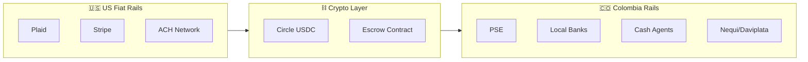
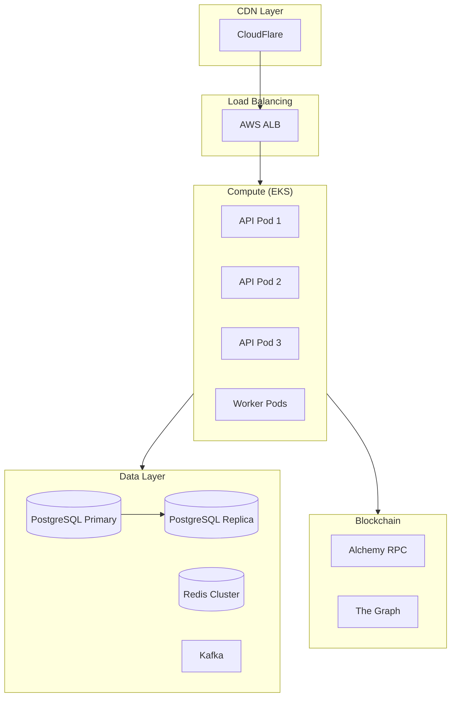
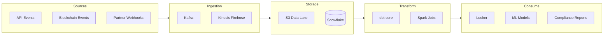

# Puente PoC — Out of Scope & Future Work

> This document lists features, integrations, and infrastructure intentionally excluded from the proof of concept. These items represent the roadmap for evolving from PoC to production-ready system.

---

## Executive Summary

| Category | PoC Scope | Production Scope |
|----------|-----------|------------------|
| Users | Single region, manual KYC | Multi-region, automated KYC/AML |
| Transactions | Testnet, mock fiat | Mainnet, real fiat rails |
| Infrastructure | Single server, local DB | Multi-AZ, distributed systems |
| Compliance | None | Full regulatory compliance |
| Monitoring | Basic logs | Full observability stack |

---

## 1. Security & Authentication

### Not Included in PoC

| Item | Description | Production Priority |
|------|-------------|---------------------|
| **Multi-factor Authentication (MFA)** | SMS, TOTP, or hardware key 2FA | P0 — Critical |
| **Wallet Signature Auth** | Sign-in with Ethereum (SIWE) | P1 — High |
| **Session Management** | Token refresh, device tracking, concurrent session limits | P0 — Critical |
| **Rate Limiting** | API throttling, DDoS protection | P0 — Critical |
| **IP Allowlisting** | Geographic restrictions, VPN detection | P1 — High |
| **Audit Logging** | Immutable logs of all user actions | P0 — Critical |
| **Encryption at Rest** | Database and file encryption | P0 — Critical |
| **Secret Rotation** | Automated key/credential rotation | P1 — High |
| **Penetration Testing** | Third-party security audit | P0 — Critical |
| **Bug Bounty Program** | Public vulnerability disclosure | P2 — Medium |

### Future Implementation Notes

```
Phase 1: MFA + Rate Limiting + Audit Logs
Phase 2: SIWE + Session Management + Encryption
Phase 3: Penetration Testing + Bug Bounty
```

---

## 2. KYC/AML Compliance

### Not Included in PoC

| Item | Description | Production Priority |
|------|-------------|---------------------|
| **Identity Verification** | Document scanning, liveness detection (Jumio, Onfido) | P0 — Critical |
| **Sanctions Screening** | OFAC, UN, EU sanctions list checks | P0 — Critical |
| **PEP Screening** | Politically Exposed Persons database | P0 — Critical |
| **Transaction Monitoring** | Real-time suspicious activity detection | P0 — Critical |
| **SAR Filing** | Suspicious Activity Report automation | P0 — Critical |
| **Travel Rule Compliance** | VASP-to-VASP information sharing (FATF) | P1 — High |
| **Risk Scoring** | Dynamic user risk assessment | P1 — High |
| **Enhanced Due Diligence** | High-risk user additional verification | P1 — High |
| **Ongoing Monitoring** | Periodic re-verification of users | P2 — Medium |
| **Jurisdiction Management** | Country-specific compliance rules engine | P1 — High |

### Regulatory Considerations

```
US Requirements:
- FinCEN MSB registration
- State money transmitter licenses (47 states)
- BSA/AML program

Colombia Requirements:
- Superintendencia Financiera registration
- SARLAFT compliance (AML framework)
- Foreign exchange regulations (Banco de la República)

Cross-border:
- FATF Travel Rule (transactions > $3,000)
- OFAC sanctions compliance
- Data localization requirements
```

---

## 3. Fiat Integration

### Not Included in PoC

| Item | Description | Production Priority |
|------|-------------|---------------------|
| **US Bank Integration** | ACH, wire transfers via Plaid/Stripe | P0 — Critical |
| **Debit Card Processing** | Card-to-crypto on-ramp | P1 — High |
| **Colombia Bank Rails** | PSE, local bank transfers | P0 — Critical |
| **Cash Agent Network** | Integration with cash pickup points | P0 — Critical |
| **Mobile Money** | Nequi, Daviplata integration | P1 — High |
| **FX Hedging** | Real-time rate locking, hedging strategies | P1 — High |
| **Settlement Reconciliation** | Automated matching of fiat/crypto legs | P0 — Critical |
| **Nostro/Vostro Accounts** | Pre-funded accounts for liquidity | P1 — High |
| **Chargeback Handling** | Dispute resolution workflow | P1 — High |
| **Payment Reversals** | Failed payment recovery | P1 — High |

### Integration Architecture (Future)



---

## 4. Blockchain & Smart Contracts

### Not Included in PoC

| Item | Description | Production Priority |
|------|-------------|---------------------|
| **Mainnet Deployment** | Polygon/Base mainnet with real USDC | P0 — Critical |
| **Multi-sig Treasury** | Gnosis Safe for fund management | P0 — Critical |
| **Upgradeable Contracts** | Proxy pattern for contract upgrades | P1 — High |
| **Chainlink Oracles** | Real-time FX price feeds | P0 — Critical |
| **Gas Optimization** | Batch transactions, gas estimation | P1 — High |
| **MEV Protection** | Flashbots or private mempool | P2 — Medium |
| **Multi-chain Support** | Deploy on multiple L2s (Arbitrum, Optimism) | P2 — Medium |
| **Cross-chain Bridges** | CCIP or LayerZero integration | P3 — Low |
| **On-chain KYC** | Polygon ID or similar attestations | P1 — High |
| **Compliance Oracles** | On-chain sanctions checking | P1 — High |
| **Liquidity Pools** | Automated market making for COP/USDC | P2 — Medium |
| **Yield Generation** | Treasury yield strategies (Aave, Compound) | P3 — Low |

### Smart Contract Audit Requirements

```
Pre-mainnet Checklist:
□ Internal security review
□ External audit (Trail of Bits, OpenZeppelin, Halborn)
□ Formal verification of critical functions
□ Bug bounty on testnet
□ Gradual rollout with caps
```

---

## 5. Infrastructure & DevOps

### Not Included in PoC

| Item | Description | Production Priority |
|------|-------------|---------------------|
| **Multi-AZ Deployment** | High availability across zones | P0 — Critical |
| **Auto-scaling** | Kubernetes HPA, cluster autoscaler | P1 — High |
| **Database Replication** | PostgreSQL read replicas, failover | P0 — Critical |
| **Redis Cluster** | Distributed caching, session storage | P1 — High |
| **Message Queue** | Kafka/SQS for async processing | P1 — High |
| **CDN** | CloudFront/Cloudflare for static assets | P2 — Medium |
| **WAF** | Web Application Firewall | P0 — Critical |
| **DDoS Protection** | CloudFlare or AWS Shield | P0 — Critical |
| **Secrets Management** | HashiCorp Vault or AWS Secrets Manager | P0 — Critical |
| **Infrastructure as Code** | Terraform for all resources | P1 — High |
| **Blue/Green Deployments** | Zero-downtime releases | P1 — High |
| **Disaster Recovery** | Cross-region backup and restore | P0 — Critical |
| **Chaos Engineering** | Failure injection testing | P3 — Low |

### Target Architecture (Production)



---

## 6. Monitoring & Observability

### Not Included in PoC

| Item | Description | Production Priority |
|------|-------------|---------------------|
| **APM** | Datadog, New Relic, or Dynatrace | P0 — Critical |
| **Log Aggregation** | ELK Stack or Datadog Logs | P0 — Critical |
| **Distributed Tracing** | OpenTelemetry, Jaeger | P1 — High |
| **Metrics & Dashboards** | Grafana, custom KPI dashboards | P0 — Critical |
| **Alerting** | PagerDuty integration, on-call rotation | P0 — Critical |
| **SLO/SLA Monitoring** | Latency, availability, error rate targets | P1 — High |
| **Blockchain Monitoring** | Transaction tracking, gas alerts | P0 — Critical |
| **Business Metrics** | Volume, conversion, corridor analysis | P1 — High |
| **User Analytics** | Mixpanel, Amplitude | P2 — Medium |
| **Error Tracking** | Sentry for frontend/backend errors | P1 — High |

### Key Metrics to Track (Future)

```
Operational:
- API latency (p50, p95, p99)
- Transaction success rate
- Blockchain confirmation time
- System uptime (target: 99.95%)

Business:
- Daily/monthly transaction volume
- Average transaction size
- Corridor utilization (US→COL)
- Customer acquisition cost
- Revenue per transaction
```

---

## 7. Mobile Application

### Not Included in PoC

| Item | Description | Production Priority |
|------|-------------|---------------------|
| **React Native App** | iOS and Android mobile apps | P0 — Critical |
| **Biometric Auth** | Face ID, Touch ID, fingerprint | P1 — High |
| **Push Notifications** | Transaction status, marketing | P1 — High |
| **Deep Linking** | App-to-web continuity | P2 — Medium |
| **Offline Mode** | Cached data, queue transactions | P2 — Medium |
| **In-app Wallet** | Embedded wallet (Privy, Dynamic) | P1 — High |
| **QR Code Payments** | Scan-to-pay functionality | P2 — Medium |
| **App Store Compliance** | Apple/Google review requirements | P0 — Critical |
| **Mobile-specific KYC** | Camera-based document scanning | P1 — High |
| **Localization** | Spanish, Portuguese language support | P1 — High |

---

## 8. Additional Features

### Not Included in PoC

| Item | Description | Production Priority |
|------|-------------|---------------------|
| **Recurring Transfers** | Scheduled, automatic remittances | P1 — High |
| **Beneficiary Management** | Save frequent recipients | P1 — High |
| **Transaction History Export** | CSV/PDF for tax purposes | P2 — Medium |
| **Referral Program** | User acquisition incentives | P2 — Medium |
| **Loyalty/Rewards** | Points, fee discounts | P3 — Low |
| **Bill Pay Integration** | Pay Colombian utilities directly | P2 — Medium |
| **Business Accounts** | B2B remittance features | P2 — Medium |
| **API for Partners** | White-label, partner integrations | P2 — Medium |
| **Multi-currency Support** | Beyond USD/COP corridor | P2 — Medium |
| **Instant Delivery** | Real-time settlement to bank | P1 — High |
| **Cash Pickup Locator** | Map of agent locations | P1 — High |
| **Customer Support Chat** | In-app support, chatbot | P1 — High |
| **Dispute Resolution** | Claim filing workflow | P1 — High |

---

## 9. Data & Analytics

### Not Included in PoC

| Item | Description | Production Priority |
|------|-------------|---------------------|
| **Data Warehouse** | Snowflake/BigQuery for analytics | P1 — High |
| **ETL Pipeline** | dbt-core transformations | P1 — High |
| **Real-time Streaming** | Kafka → Flink for live data | P2 — Medium |
| **ML Fraud Detection** | Anomaly detection models | P0 — Critical |
| **Dynamic Pricing** | ML-based FX spread optimization | P2 — Medium |
| **Cohort Analysis** | User behavior analytics | P2 — Medium |
| **A/B Testing** | Feature experimentation framework | P2 — Medium |
| **Regulatory Reporting** | Automated compliance reports | P0 — Critical |
| **BI Dashboards** | Looker/Metabase for business users | P1 — High |

### Data Architecture (Future)



---

## 10. Testing & Quality

### Not Included in PoC

| Item | Description | Production Priority |
|------|-------------|---------------------|
| **Load Testing** | k6, Locust for performance testing | P1 — High |
| **Chaos Testing** | Failure injection (Chaos Monkey) | P2 — Medium |
| **Contract Testing** | Pact for API contracts | P2 — Medium |
| **E2E Testing** | Cypress/Playwright automation | P1 — High |
| **Visual Regression** | Percy, Chromatic | P3 — Low |
| **Security Scanning** | SAST/DAST in CI/CD | P0 — Critical |
| **Dependency Scanning** | Snyk, Dependabot | P1 — High |
| **Test Coverage** | >80% coverage requirement | P1 — High |
| **Staging Environment** | Production-like test environment | P0 — Critical |
| **Feature Flags** | LaunchDarkly or similar | P2 — Medium |

---

## 11. Legal & Business

### Not Included in PoC

| Item | Description | Production Priority |
|------|-------------|---------------------|
| **Terms of Service** | Legal agreement for users | P0 — Critical |
| **Privacy Policy** | GDPR/CCPA compliant | P0 — Critical |
| **MSB Licensing** | Money Services Business license | P0 — Critical |
| **State Licenses** | US state-by-state licensing | P0 — Critical |
| **Colombian License** | Local regulatory approval | P0 — Critical |
| **Insurance** | E&O, cyber liability insurance | P1 — High |
| **Banking Partnerships** | Correspondent banking relationships | P0 — Critical |
| **Agent Agreements** | Cash pickup network contracts | P0 — Critical |
| **Pricing Strategy** | Fee structure, FX markup | P0 — Critical |
| **Customer Support SLA** | Response time commitments | P1 — High |

---

## 12. Phased Roadmap

### Phase 1: MVP (Post-PoC) — 3-4 months

```
Focus: Regulatory compliance + Core functionality

□ KYC/AML integration (Jumio)
□ US bank on-ramp (Plaid ACH)
□ Colombia off-ramp (1 bank partner)
□ Mainnet deployment (Polygon)
□ Basic mobile app (React Native)
□ Production infrastructure (AWS EKS)
□ Security audit
□ MSB registration
```

### Phase 2: Scale — 3-4 months

```
Focus: User experience + Additional rails

□ Instant delivery (real-time settlement)
□ Cash pickup network (Efecty, Baloto)
□ Mobile money (Nequi, Daviplata)
□ Recurring transfers
□ Push notifications
□ Customer support integration
□ Advanced fraud detection
□ State licensing (top 10 states)
```

### Phase 3: Expansion — 6+ months

```
Focus: New corridors + Advanced features

□ Additional corridors (Mexico, Guatemala)
□ Multi-currency support
□ Business accounts (B2B)
□ Partner API / White-label
□ Loyalty program
□ Bill pay integration
□ Full state licensing (all 47)
```

---

## 13. Estimated Effort

| Phase | Duration | Team Size | Focus Areas |
|-------|----------|-----------|-------------|
| PoC | 4 weeks | 1-2 devs | Core flow validation |
| MVP | 3-4 months | 4-6 devs | Compliance, rails, security |
| Scale | 3-4 months | 6-8 devs | UX, mobile, operations |
| Expansion | 6+ months | 8-12 devs | New markets, features |

### Key Hires Needed (Post-PoC)

```
Engineering:
- Senior Backend Engineer (payments experience)
- Senior Smart Contract Engineer
- Mobile Engineer (React Native)
- DevOps/SRE Engineer
- Security Engineer

Compliance:
- Compliance Officer
- AML Analyst

Operations:
- Customer Support Lead
- Partner Manager (banking/agents)
```

---

## Summary

The PoC validates the core technical flow:

✅ **Included**: Smart contract escrow, basic API, web UI, testnet deployment

❌ **Not Included**: Everything needed for real money, real users, real compliance

The gap between PoC and production is primarily:
1. **Regulatory** — Licenses, KYC/AML, compliance programs
2. **Financial** — Real fiat rails, banking partnerships
3. **Operational** — Support, monitoring, security hardening
4. **Scale** — Infrastructure, mobile apps, additional features

---

**End of Document**
