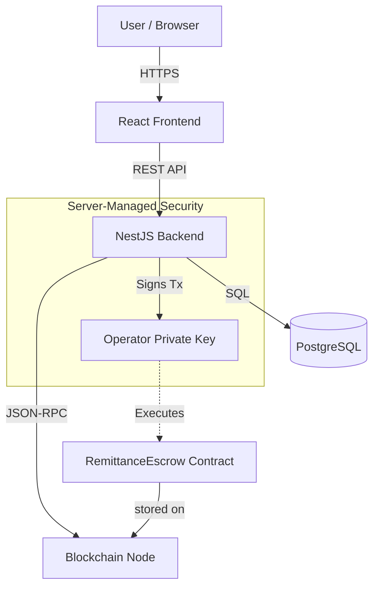
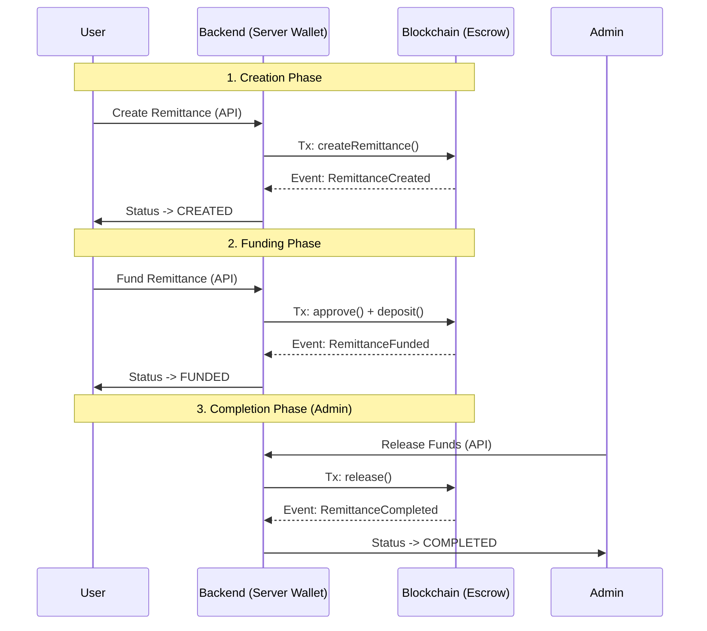
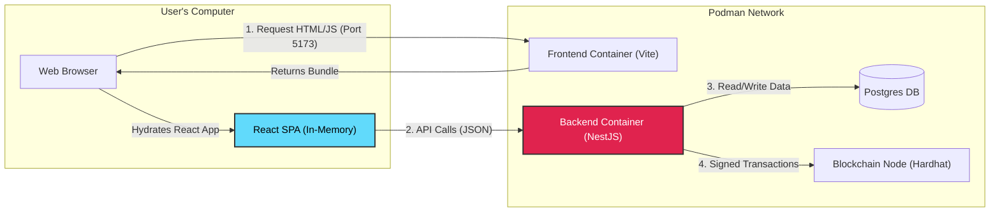

# Puente PoC

Proof of Concept for a blockchain-based remittance system.

## 🚀 Running Locally

This project uses **Podman** and **Taskfile** for easy local deployment and management.

### Prerequisites

- [Podman](https://podman.io/) (and `podman-compose`)
- [Task](https://taskfile.dev/) (go-task)
- Node.js (v18+) - *Optional, for running without containers*
- **No MetaMask required** (System uses Server-Managed Wallet)

### Quick Start

1.  **Setup & Start**:
    This command builds all Docker images, starts the services, deploys contracts, and **automatically configures** the backend with the new contract addresses.

    ```bash
    task setup
    ```

    *Note: This may take a few minutes the first time.*

2.  **Access the App**:
    - Frontend: http://localhost:5173
    - Admin Dashboard: http://localhost:5173/admin
    - Backend API: http://localhost:3000
    - Blockchain JSON-RPC: http://localhost:8545

3.  **View Logs**:
    To see the logs of all running services:

    ```bash
    task logs
    ```

4.  **Run Tests**:
    To run the backend unit tests (using Bun inside a Podman container):

    ```bash
    task test
    ```

5.  **Stop Services**:

    ```bash
    task down
    ```

### Architecture & Wallet Management

**Server-Managed Wallet (Custodial):**
This PoC uses a server-managed wallet architecture. The backend (`BlockchainService`) holds the operator private key and signs all transactions (Create, Fund, Release) on behalf of the user. This removes the need for browser extensions like MetaMask.

- **System Wallet**: Account #0 from the local Hardhat node.
- **Dynamic Configuration**: The `task setup` command automatically deploys contracts, captures their addresses, and injects them into the backend container via `.env`.

#### System Architecture



#### Transaction Flow



### 🔍 Technical Internals

To help developers understand the system quickly, here is the detailed breakdown of how components interact.

#### Detailed Component Interaction

This diagram illustrates the **Client-Side Rendering (CSR)** model and the separation of concerns.



#### Key Technical Decisions

1.  **Frontend (React + Vite)**:
    -   **SPA**: The frontend is a Single Page Application. The container only serves the static assets (HTML, JS, CSS) via Vite's dev server.
    -   **Client-Side Rendering**: All UI logic happens in the user's browser. There is **no** Server-Side Rendering (SSR).
    -   **No Web3 Deps**: The React app creates standard REST requests. It does not contain `ethers.js` logic for signing or wallet connection.

2.  **Backend (NestJS)**:
    -   **Sovereign Logic**: The backend is the single source of truth. It manages the state in both the Database (Postgres) and the Blockchain.
    -   **Server-Side Signing**: The `BlockchainService` loads the Operator Private Key (`0xac09...`) and signs transactions. This ensures users never need to manage gas or keys.

3.  **Orchestration (Taskfile)**:
    -   **Atomic Setup**: The `task setup` command ensures a strict order of operations: `Start Infra` -> `Deploy Contracts` -> `Capture Addresses` -> `Inject .env` -> `Start Apps`. This prevents "Contract Not Found" errors.

### ⚖️ Architectural Decision Record: Wallet Management

We explicitly chose a **Server-Managed (Custodial)** architecture over the traditional **Client-Side (Non-Custodial)** approach for this Proof of Concept.

| Feature | Server-Managed (Current) | Client-Side (MetaMask/Ethers.js) |
| :--- | :--- | :--- |
| **User Experience** | **Frictionless**. Works like a standard Web2 app. No setup required. | **High Friction**. Requires extension installation, account creation, and seed phrase management. |
| **Environment Support** | **Universal**. Works in Chrome, Safari, Mobile, and CI/CD containers. | **Limited**. Fails in environments without extensions (e.g., standard mobile browsers, automated tests). |
| **Complexity** | **Low**. Logic is centralized in the backend. Minimal frontend state. | **High**. Frontend must handle connection states, chain switching, and signing rejections. |
| **Security Model** | **Trust-based**. Users trust the platform (Operator) to hold funds. | **Trustless**. Users control their own keys and funds. |
| **PoC Suitability** | **Ideal**. Guarantees a "works out of the box" experience for reviewers. | **Risky**. Reviewers may face "Wallet not found" errors or network mismatches. |

#### 💼 Business Value Analysis

Beyond technical simplicity, avoiding client-side signing allows for key business advantages:

1.  **Gas Abstraction (Cost Control)**:
    *   **Advantage**: Users do not need to hold native tokens (e.g., ETH, MATIC) to pay for gas. The platform pays the gas fees, simplifying onboarding for non-crypto users.
    *   **Advantage**: The business can implement "Gasless" experiences natively without complex meta-transaction relays.

2.  **Compliance & Control (KYC/AML)**:
    *   **Advantage**: The platform acts as a gatekeeper. We can block a transaction *before* it hits the blockchain if it fails KYC/AML checks. With client-side signing, a user might try to interact directly with the contract (bypassing the UI), requiring complex on-chain whitelisting.

3.  **Account Recovery**:
    *   **Advantage**: If a user loses their password, the business can reset it. In a client-side model, if a user loses their seed phrase, their funds are irretrievably lost.

4.  **Disadvantage: Custodial Risk**:
    *   **Risk**: The platform holds strict liability for user funds. If the *Operator Private Key* is compromised, all user funds are at risk. This requires institutional-grade security (HSMs, Multi-sig) for production, which is a significant operational cost.

**Conclusion:**
For the purpose of this PoC, **Server-Managed** is superior because it ensures that anyone cloning the repo can run the full remittance flow immediately without needing to configure an external wallet or acquire testnet funds manually. The focus is on demonstrating the *business logic* (Escrow, Release, Refund) rather than wallet connectivity.

### 🧰 Useful Commands

- **Full Setup**: `task setup` (Clean deploy + App start)
- **Deep Clean**: `task clean` (Removes containers AND persistent database volumes - Fixes "stale data" issues)
- **View Logs**: `task logs`
- **Run Contract Tests**: `task test-contracts`

## Project Structure

- `contracts/`: Hardhat project for Smart Contracts (Solidity)
- `backend/`: NestJS API (Port 3000)
- `frontend/`: React + Vite UI (Port 5173)

## 📊 Remittance Status Workflow

Understanding the lifecycle of a remittance is key to debugging and verification.

### Status Definitions

- `PENDING`: Initial state when user starts the flow. Database record created, but blockchain transaction not yet initiated or confirmed.
- `CREATED`: Blockchain contract (Escrow) has successfully created the remittance record on-chain.
- `FUNDED`: User has deposited the USDC amount into the contract. Funds are locked.
- `COMPLETED`: Admin/Operator has released the funds to the recipient. Cycle complete.
- `REFUNDED`: Admin/Operator has returned the funds to the sender.
- `FAILED`: An error occurred during creation or processing.

### ✅ Successful Flow

1.  **PENDING** → **CREATED**:
    -   User clicks "Create".
    -   Backend creates DB record (`PENDING`).
    -   Backend signs and sends `createRemittance` tx to blockchain.
    -   On tx success, status updates to `CREATED`.

2.  **CREATED** → **FUNDED**:
    -   User clicks "Fund" in Dashboard.
    -   Backend signs and sends `deposit` tx to blockchain.
    -   On tx success, status updates to `FUNDED`.

3.  **FUNDED** → **COMPLETED**:
    -   Admin reviews and clicks "Complete" (Release).
    -   Backend signs and sends `release` tx.
    -   On tx success, status updates to `COMPLETED`.

### ❌ Error/Alternative Flows

-   **PENDING** → **FAILED**:
    -   If the blockchain transaction to create the remittance fails (e.g., operator out of gas, contract reverted).
    -   The remittance stops here and cannot be funded.

-   **FUNDED** → **REFUNDED**:
    -   If the transaction cannot be completed (e.g., incorrect recipient), Admin clicks "Refund".
    -   Funds are returned to sender on-chain.
    -   Status updates to `REFUNDED`.

-   **Stuck in PENDING?**
    -   Check backend logs. It usually means the blockchain transaction is incomplete or the backend failed to update the status after the transaction.

## ✅ Manual Verification Steps

1.  **Open the App**:
    [http://localhost:5173](http://localhost:5173).

2.  **Login**:
    -   Click "Login".
    -   Use the default seeded user:
        -   **Email**: `default@example.com`
        -   **Password**: `defa-key-2026$`

3.  **Wallet Connection**:
    -   You will see **"Server Managed Wallet"** in the top right. It is always connected.

4.  **Create Remittance**:
    -   Go to "New Remittance".
    -   Enter Recipient ID (e.g., "CC-123456") and Amount (e.g., 100 USDC).
    -   Click "Create". The backend will handle the blockchain transaction.
    -   You should see a success toast and be redirected to the Dashboard.

5.  **Fund Remittance**:
    -   On the Dashboard, find the new remittance (Status: `CREATED`).
    -   Click "Fund Remittance".
    -   Button will show "Processing...".
    -   After ~5-10 seconds, the status will update to **`FUNDED`**.

6.  **Admin Verification (Release Funds)**:
    -   Go to [http://localhost:5173/admin](http://localhost:5173/admin).
    -   You will see the list of all remittances with detailed "Event History".
    -   Click the **"Release"** button next to the funded remittance.
    -   Status will update to **`COMPLETED`**.
    -   You can expand the "Logs" column to see transaction hashes and stack traces.

6.  **Verify Backend**:
    -   Check [http://localhost:3000/](http://localhost:3000/). Should respond: "Puente PoC Backend is Running!".
